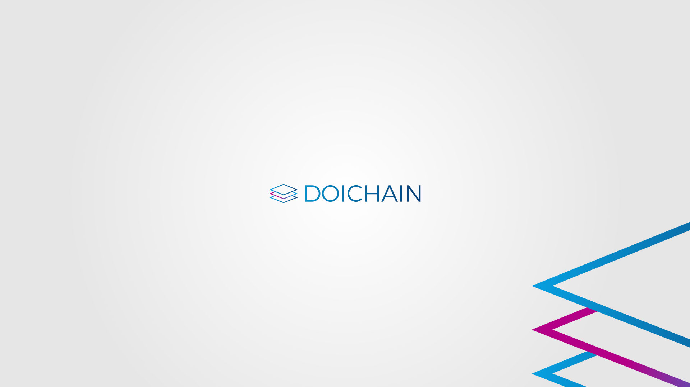

<h1 align="center">BlockPro</h1>

<p align="center">
  
</p>

<p align="center"> 
  <a href="https://github.com/webanizer/BlockPro/releases"></a>
  <a href="https://www.linkedin.com/company/webanizer-ag/about/"></a>
  <a href="https://github.com/webanizer/BlockPro/issues"></a>
  <a href="https://www.youtube.com/channel/UChqFCLQ0UfCL9GGgyS0I5oQ"></a>
  <a href="https://github.com/webanizer/BlockPro/blob/main/LICENSE.txt"></a>
</p>

## Table of Contents
- [Background](#background)
- [Install](#install)
- [Usage](#usage)
- [Resources](#resources)
- [Contributing](#contributing)
- [License](#license)

## Background

Im Rahmen des BlockPro Projekts wird ein blockchainbasierter Herkunftsnachweis für erneuerbare Energien entwickelt. Transaktionen zwischen Energieerzeuger und Konsumenten werden manipulations- und revisionssicher in der Doichain gespeichert. Bisher wird Grünstrom auf Kontingentbasis verkauft, wohingegen mit BlockPro genaue Daten für den Peer-to-Peer-Handel erfasst werden. So können Jahresspitzenlasten ausgeglichen und Netznutzungsgebühren eingespart werden. 

## Install
1. git clone this repo 
2. run ```npm i``` in root directory
3. run ```docker-compose up``` to start 3 p2plib hosts in the docker environment, an electrumx server and doichain-node only in regtest
4. connect to regtest: ```docker exec -it regtest bash```
   To create a balance run this in container regtest:
   ```doichain-cli -generate 101```
5. connect to peer1 ```docker-compose exec peer1 bash```, install: ```npm i -g npm@6.10``` and run ```npm run peer1```
6. connect to peer2 ```docker-compose exec peer1 bash```, install: ```npm i -g npm@6.10``` and run ```npm run peer2```
7. connect to peer3 ```docker-compose exec peer3 bash```, install: ```npm i -g npm@6.10``` and run ```npm run peer3```
8. in container regtest create a new block to trigger new game for the peers with: ```doichain-cli -generate 1```
9. if needed configure requestInterval in settings.json to change the interval time in seconds in which meter data is collected 
10. if encountering electrumx error connecting to (doichain) daemon: In regtest container try: ```doichaind --reindex```

## Usage 

BlockPro dient dem Herkunfts- und Verbrauchsnachweis von erneuerbarer Energie zwischen Produzenten und Konsumenten (Prosumenten).
Über das Second-Layer Modell werden im Konsens Prosumenten ausgewählt, die die gesammelten Zählerstände aller peers in die Doichain schreiben und hierfür ein Bounty erhalten. 

<p align="center">
  
</p>


## Resources
1. Serial Port npm package for reading meter data https://www.npmjs.com/package/serialport
2. Bitcoinjs-lib used for doichainjs-lib
   https://github.com/bitcoinjs/bitcoinjs-lib 
3. p2p lib used in 2nd Layer model 
   https://github.com/libp2p/js-libp2p

## Contributing

<a href="https://github.com/webanizer/BlockPro/graphs/contributors">
  
</a>


Small note: If editing the Readme, please conform to the [](https://github.com/RichardLitt/standard-readme) specification.

## License

[](https://opensource.org/licenses/MIT)

[MIT © 2021 Webanizer AG.](./LICENSE.txt)


<!-- MARKDOWN LINKS & IMAGES -->
<!-- https://www.markdownguide.org/basic-syntax/#reference-style-links -->
[version-shield]: https://img.shields.io/github/package-json/v/webanizer/BlockPro
[version-url]: https://github.com/webanizer/BlockPro/releases
[contributors-shield]: https://img.shields.io/github/contributors/othneildrew/Best-README-Template.svg?style=for-the-badge
[contributors-url]: https://github.com/webanizer/BlockPro/graphs/contributors
[commits-shield]: https://img.shields.io/github/commit-activity/m/webanizer/BlockPro
[commits-url]: https://github.com/webanizer/BlockPro/commits/main
[stars-shield]: https://img.shields.io/github/stars/webanizer/BlockPro?style=social
[stars-url]: https://github.com/webanizer/BlockPro/stargazers
[issues-shield]: https://img.shields.io/github/issues-closed-raw/webanizer/BlockPro
[issues-url]: https://github.com/webanizer/BlockPro/issues
[license-shield]: https://img.shields.io/npm/l/doichain
[license-url]: https://github.com/webanizer/BlockPro/blob/main/LICENSE.txt
[linkedin-shield]: https://img.shields.io/badge/LinkedIn-blue?style=flat&logo=linkedin&labelColor=blue
[linkedin-url]: https://www.linkedin.com/company/webanizer-ag/about/
[youtube-shield]: https://img.shields.io/youtube/channel/views/UChqFCLQ0UfCL9GGgyS0I5oQ?style=social
[youtube-url]: https://www.youtube.com/channel/UChqFCLQ0UfCL9GGgyS0I5oQ
[twitter-shield]: https://img.shields.io/twitter/url?style=social&url=https%3A%2F%2Ftwitter.com%2Fdoichain
[twitter-url]: https://twitter.com/doichain
